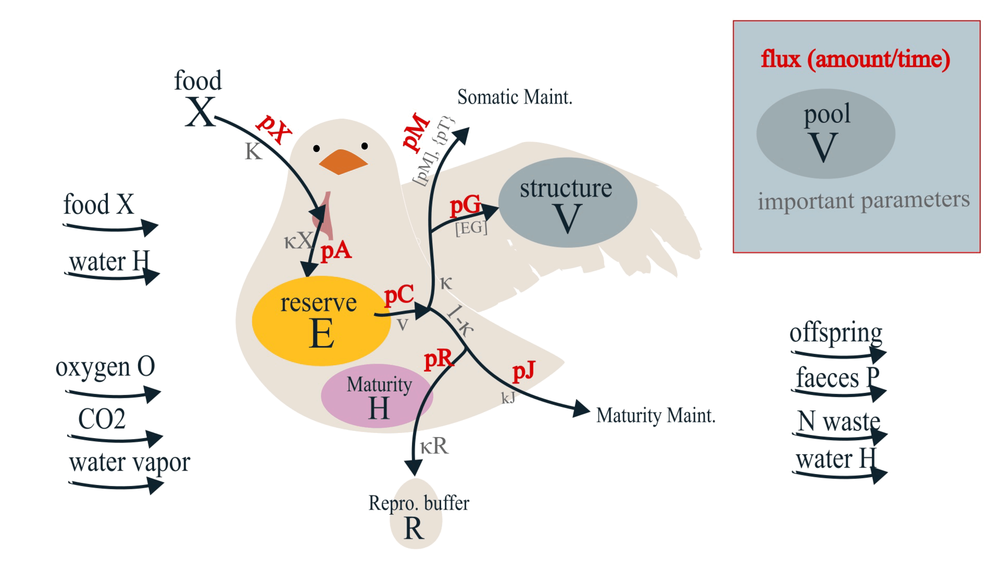
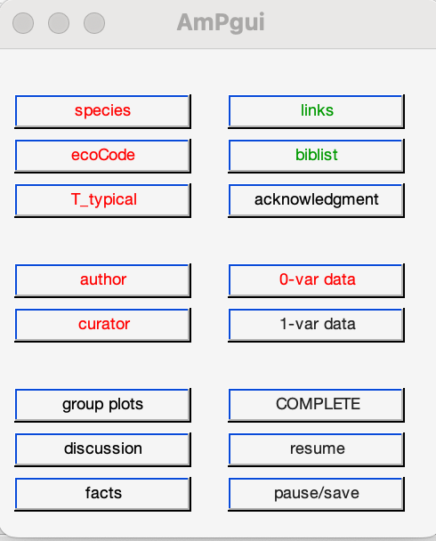

# **D**ynamic **E**nergy **B**udget - DEB

**Table of Contents:**

- [**D**ynamic **E**nergy **B**udget - DEB](#dynamic-energy-budget---deb)
- [Concept figure](#concept-figure)
- [DEB equations](#deb-equations)
  - [basics - reserve dynamics](#basics---reserve-dynamics)
  - [allocation of pC](#allocation-of-pc)
- [Existing models](#existing-models)
  - [MATLAB tools (original DEB)](#matlab-tools-original-deb)
  - [NicheMapR (Habitat modeling)](#nichemapr-habitat-modeling)
  - [FABM, FABM-DEB (Hydrodynamic coupling)](#fabm-fabm-deb-hydrodynamic-coupling)
  - [Population models](#population-models)
    - [IBM (Individual-Based-Model)](#ibm-individual-based-model)
    - [EBT](#ebt)
    - [CPM](#cpm)
- [Useful web interfaces](#useful-web-interfaces)
- [Acquire parameters](#acquire-parameters)
  - [From AmP collection](#from-amp-collection)
    - [In MATLAB](#in-matlab)
    - [In R](#in-r)
  - [Parameter estimation with literature/experimental data](#parameter-estimation-with-literatureexperimental-data)
    - [Better-to-have data](#better-to-have-data)
    - [parameter estimation preparation](#parameter-estimation-preparation)
    - [Parameter estimation procedure](#parameter-estimation-procedure)
- [Further DEB modeling](#further-deb-modeling)
      - [State Variables](#state-variables)
      - [ODE In standard DEB model (std)](#ode-in-standard-deb-model-std)
      - [DEB model can be coupled](#deb-model-can-be-coupled)

# Concept figure
[DEB website](https://debportal.debtheory.org/docs/)


> 
> 
# DEB equations
## basics - reserve dynamics

(refer to graph above, from top to bottom, left to right)

- food ingestion rate $\dot{p_X}$ $$\dot{p_X} = \dot{\{p_{Xm}\}}f(X)L^2$$
- assimilation flux $\dot{p_A}$ $$\dot{p_A} = \dot{\{p_{Am}\}} f(X) L^2$$
- Reserve $E$
$$\frac{dE}{dt} = \dot{p_A} - \dot{p_C}$$
- Reserve density $E/V$
$$\frac{d[E]}{dt} = \dot{[p_A]} - \dot{[p_C]} - [E]\dot{r}$$
- mobilization flux $\dot{p_C}$     
    $$\dot{p_C} = E (\frac{\dot{v}}{L} - \dot{r})$$
    $$\dot{[p_C]} = [E](\frac{\dot{v}}{L} - \dot{r})$$ 
## allocation of pC
  $$\dot{p_C} = \textcolor{blue}{\dot{p_S} + \dot{p_G} }+ \textcolor{red}{\dot{p_J} + \dot{p_R}}$$

fraction $\color{blue}\kappa$       -->     $\color{blue}\dot{p_S}$ and $\color{blue}\dot{p_G}$,

fraction $\color{red}1-\kappa$   -->     $\color{red}\dot{p_J}$ and $\color{red}\dot{p_R}$

- somatic maintenance $\color{blue}\dot{p_S}$
    $$\dot{p_S} = \dot{[p_M]} L^2 + \dot{\{p_T\}} L^3$$
- energy allocated to growth $\color{blue}\dot{p_G}$
    $$\dot{p_G} = \kappa\dot{p_C} - \dot{p_S} $$
    $$\dot{p_G} = [E_G] \frac{dV}{dt}$$
- specific growth rate $\color{blue}\dot{r}$
    $$\dot{r} = \frac{1}{V}\frac{dV}{dt}$$
    OR?
    $$\dot{r} = \frac{d}{dt}lnV$$
    OR?
    $$\dot{r} = \frac{\dot{[p_G]}
    }{[E_G]}$$
- maturity maintenance $\color{red}\dot{p_J}$
    $$\dot{p_J} = \dot{k_J} * E_H$$

- maturation (embryo-juvenile) $\color{red}\dot{p_R}$
    $$\dot{p_R} = (1 - \kappa) \dot{p_C} - \dot{p_J} $$
    $$\frac{dE_H}{dt} = \dot{p_R}$$
- reproduction (adult) $\color{red}\dot{p_R}$
    $$\dot{p_R} = (1 - \kappa) \dot{p_C} - \dot{p_J}$$
    $$\frac{dE_R}{dt} = \kappa_R \dot{p_R}$$

>[MORE DERIVATIONS](DEB_derivations/derivations.md) for equations
# Existing models 
some of these packages are required to run the scripts in ```code_pu``` (or `src`)

## MATLAB tools (original DEB)

[DEBtool](https://debtool.debtheory.org/docs/index.html)
> *DEBtool illustrate some implications of the DEB theory*

[AmPtool](https://amptool.debtheory.org/docs/index.html)

> *AmPtool analyses patterns in DEB parameters*

> **install and configuration:**
Need MATLAB. In MATLAB, `Home` >> `set path` and direct to the source code

## NicheMapR (Habitat modeling)
[NicheMapR package](https://mrke.github.io/getting_started/)

> *NicheMapR is written by Michael Kearney. It includes Microclimates, Ectotherms, Endotherms, Plants, Dynamic Energy Budgets modules that can be coupled together to do habitat and behavioral modeling*


> **install and configuration:**
[install package from github tutorial](https://cran.r-project.org/web/packages/githubinstall/vignettes/githubinstall.html) 

## FABM, FABM-DEB (Hydrodynamic coupling)


[FABM](https://github.com/fabm-model/fabm)

[FABM-DEB](https://github.com/jornbr/fabm-deb) (it is a population model)

> *FABM couples hydrodynamic models with biogeochemical models. There is a FABM-DEB model constructed by 
Jorn Bruggeman*

> **installation and configuration**
```shell
# >>>>>> install and compile FABM-DEB with 0d driver
FABMDIR="~/src/fabm" 	# Path to FABM source code
GOTMDIR="~/src/GOTM6" 	# Path to GOTM source code 
compiler="/opt/homebrew/bin/gfortran" 	# fortran compiler on this computer

mkdir -p ~/build/fabm-0d && cd ~/build/fabm-0d

cmake $FABMDIR/src/drivers/0d -DGOTM_BASE=$GOTMDIR -DCMAKE_Fortran_COMPILER=$compiler -DFABM_INSTITUTES="akvaplan;au;bb;csiro;ersem;examples;gotm;iow;jrc;msi;niva;pclake;pml;selma;su;uhh;deb" -DFABM_DEB_BASE=~/src/fabm-deb

make install

# >>>>>> generate yaml files >>>>>>>
https://github.com/fabm-model/fabm/wiki/Setting-up-a-simulation

# >>>>>> run fabm0d coupled with deb >>>>>>>
cd /Users/tongyaop/test_funcs_local/fabm-deb/0d_deb_test
~/local/fabm/0d/bin/fabm0d -y ./fabm-deb.yaml


```

Or use [pydeb](https://github.com/jornbr/pydeb):
```shell
# >>>>>> run deb in pydeb >>>>>>>

# python packages : NumPy, Python, Jupyter, plotly

# install pydeb:
PYDEB_DIR=~/src/pydeb
python -m pip install $PYDEB_DIR --user

# run a deb model:
# go to $PYDEB_DIR/examples

```
## Population models


### IBM (Individual-Based-Model)
> **installation and configuration** 

1. Install `NetLogo`

2. set path in `.bash_profile` for MacOS
```shell
cd
vim .bash_profile
export JAVA_HOME=/Library/Internet\ Plug-Ins/JavaAppletPlugin.plugin/Contents/Home
export EBTPATH=/Applications/EBTtool.app/Contents/Resources
export PATH=${JAVA_HOME}/bin:/Applications/NetLogo\ 6.2.0/app:/Applications/EBTtool.app/Contents/MacOs:$PATH
```

3. To run: use `IBM()` function in MATLAB (from `DEBtool`)

```
    [txNL23W, info] = IBM('Daphnia_magna', [], [], [], [], [], [], 80, 1);
```

### EBT

> **installation and configuration** Need fortran compiler and MATLAB 

To run: use `EBT()` function in MATLAB (from `DEBtool`). 

```
[txNL23W, info] = EBT('Daphnia_magna', [], [], [], [], [], 80);
```

### CPM 
> EXPLAIN
# Useful web interfaces
- [AmP (Add my pet) portal](https://www.bio.vu.nl/thb/deb/deblab/add_my_pet/)

- [NicheMapR shiny apps](https://mrke.github.io/): Online habitat and DEB modeling

- [Debber](https://deb.bolding-bruggeman.com/): Estimates DEB parameters and provide confidence interval ranges.


> This could be a documentation for the DEBtool github. Instead of just linking https://bio.vu.nl/thb/deb/deblab/ in the github readme file (That's could be where the frustrating, because you are getting back to where you came from), maybe explain a little bit about how to work with the code.
>


# Acquire parameters
## From AmP collection
*Even a species exist in the collection, it can be improved*

[AmP website](https://www.bio.vu.nl/thb/deb/deblab/add_my_pet/)
> This website should get a top-left figure to click on to go back to the home page
>
`COLLECTION` > `AmPdata.zip`

### In MATLAB

1. Put `AmPdata` to MATLAB path
2. In MATLAB,
```MATLAB
load AmPdata
```

### In R

(copied from [NicheMapR tutorial](https://mrke.github.io/NicheMapR/inst/doc/deb-model-tutorial))

```R
install.packages('R.matlab')
library(R.matlab)

allStat <- readMat('allStat.mat') # this will take a few minutes
save(allStat, file = 'allstat.Rda') # save it as an R data file for faster future loading
library(knitr) # this packages has a function for producing formatted tables.

load('allStat.Rda')

allDEB.species<-unlist(labels(allStat$allStat)) # get all the species names
allDEB.species<-allDEB.species[1:(length(allDEB.species)-2)] # last two elements are not species names
kable(head(allDEB.species))
Nspecies <- length(allStat$allStat)
Nspecies

species <- "Eulamprus.quoyii"
species.slot <- which(allDEB.species == species)
par.names <- unlist(labels(allStat$allStat[[species.slot]]))

for(i in 1:length(par.names)){
 assign(par.names[i], unlist(allStat$allStat[[species.slot]][i]))
}
```

## Parameter estimation with literature/experimental data
### Better-to-have data
|             Data to be collected              | Common symbol |
| --------------------------------------------- | ------------- |
| length-weight relationship                    |               |
| length at first feeding (birth)               | $L_b$         |
| length at puberty                             | $L_p$         |
| max mass                                      | $L_m$         |
| max reproduction rate                         | $R_i$         |
| time from conception to first feeding (birth) | $a_b$         |
| time from first feeding (birth) to puberty    | $a_p$         |
| life span                                     | $a_m$         |
| *metamorphasis info                           |               |
| *other types of weight                        |               |
| *growth data from birth to death              |               |
| *any forms of rate                            |               |
| *reproduction                                 |               |
| *temperature dependence                       |               |

*Better to be under known constant temperature, saturated food conditions (f = 1). This is not a hard requirement.*

*Start working on all the available data and then reduce the weight of some data if they are uncertain and provides bad estimations*

> :exclamation: Provide an univariate dataset here in txt/xlsx file form. 
> 
### parameter estimation preparation
1. Create directory `Taeniopygia_guttata_test`
2. In MATLAB, change directory to `Taeniopygia_guttata_test`, then run `AmPeps` in the command window. The following window will pop up
   
    
3. Type in corresponding information:
   |||
   |-|-|
   |species| Taeniopygia_guttata_test |
   |ecoCode|climate: Af|
   ||	ecozone: TPi, TA|
   ||	habitat: 0iTh, 0iTi, 0iTs, 0iTg, 0iTa|
   ||embryo: Tnsf, Tnpf|
   ||	migrate:|
   ||	food: biCi, biHs|
   ||	gender: Dg|
   ||reprod: O|
   |T_typical|42°C|
   
   Add to `0-var data`
   ||Value|Reference|
   |-|-|-|
   |age at birth|15 d|Wiki|
   |time since birth at puberty|300 d|Wiki|
   |life span|4360 d|voliere|AnAge|
   |wet weight at birth| 0.8 g|Wiki|
   |ultimate wet weight	|11.7 g|AnAge|
   |maximum reproduction rate|0.0137|Wiki|
   
   You can also add to `1-var data`
   
   Add the reference list to biblist

   Add author (your name)

   Add curator (this will not send the information directly)

   Add data completeness 

   If finishes, click `pause/save` > `quit AmPgui, continue with AmPeps`
   

4. `AmPeps` will then generate four MATLAB scripts. Edit accordingly
   - `mydata_*.m` includes observational data you just typed in. You can add to this by typing or using MATLAB functions (e.g. `load`, `readmatrix`). Code up corresponding temperature/food if they vary with time.
   - `pars_init_*.m` don't need to be edited at this stage. 
   - `predict_*.m` includes prediction models for observational data. Add in your own model if the auto-generated one is not ideal. 
   - `run_*.m` specifies estimation options and run the parameter estimation process.
  
*predict model examples can be searched in [AmP website](https://www.bio.vu.nl/thb/deb/deblab/add_my_pet/) > COLLECTION > search for relevant models (e.g. t-L (time-length), T-F(temperature-filtration rate)), click into the species with these models, look at their `predict_` file and get inspired*

### Parameter estimation procedure
[AmPestimation](https://debportal.debtheory.org/docs/AmPestimation.html)


Open the `run_*.m` script, you will see:

```MATLAB
close all; 
global pets 

pets = {'Taeniopygia_guttata'}; 
check_my_pet(pets); 

estim_options('default');  % initialize estimation options
estim_options('max_step_number', 5e2); % maximum 
estim_options('max_fun_evals', 5e3); 

estim_options('pars_init_method', 2); 
estim_options('results_output', 3); 
estim_options('method', 'no'); 

estim_pars; 
```


The parameter estimation procedure compares observational data in `mydata_*.m` with DEB model described in `predict_*.m` using parameters defined in `pars_init_*.m` 

The comparison result is evaluated with loss function. 

By running `run_*.m` in MATLAB, this procedure is repeated for many times (until `max_step_number`), or until the minimum of the loss function is found.

If the minimum of loss function is not found (did not converge), edit `pars_init_method` to `1` (now reading parameters from previous-procedure-generated `results_*.mat`); then run `run_*.m` again in MATLAB until convergence is reached.

In the MATLAB command window, type `mat2pars_init`. This will rewrite the estimated parameter sets to the `pars_init_*.m` file. 

:exclamation: Make sure to look at the generated .html page, evaluate if the predicted data is physical, and look at if MRE is small. If not, you might want to fix a certain parameter or set less weight to the questionable observational dataset.

To fix a parameter: open `pars_init_*.m`, change `par.**` based on your best guess, and set `free.**` = 0.

To set dataset weight, open `mydata_*.m`, in the `%% set weights for all real data` section, change/type `weights.** = 0` if you don't want this data to affect parameter estimation, or `weights.** = 5` if you feel the dataset is of great importance.


# Further DEB modeling
Extract the estimated parameters, and use that in a designated models (e.g. self-coded DEB model, NicheMapR, other coupling modules, population models). Sometimes a full-set of ODE (ordinary differential equation) is needed to simulate the influence of time-varying temperature or food concentration. 

#### State Variables
Variables to be modeled. Typical DEB state variables:
|           | Variable |                     Dynamics                      |
| --------- | -------- | ------------------------------------------------- |
| Reserve   | $E$      | $\frac{dE}{dt} = \dot{p_A} - \dot{p_C}$           |
| Structure | $V$      | $\frac{dV}{dt} = \frac{\dot{p_G}}{[E_G]}$         |
| Maturity  | $E_H$    | $\frac{dE_H}{dt} = \dot{p_R}$ (before maturation) |
|Reproduction|$E_R$|$\frac{dE_R}{dt} = \dot{p_R}$ (after maturation)|

Where $\dot{p_A}$ is assimilation flux. $\dot{p_C}$, $\dot{p_G}$, and $\dot{p_R}$ are fluxes, all links to the reserve dynamics which can be expressed explicitly. Since all the dynamics of the state variables can be expressed explicitly, the dynamics can be solved with ODE (ordinary differential equation) solver.

#### ODE In standard DEB model (std)
The ODEs are constructed by the dynamic equations above. Here is one coding example. This pieces of code generates 4-vector with state variabels `ELHR`, correspond to time `t`

```MATLAB
GIVE A CODING EXAMPLE, Maybe AmPtools/trajectory/>std model
```

#### DEB model can be coupled
DEB has the potential to be coupled with physical environmental models, population dynamic models, ecological models etc. 
